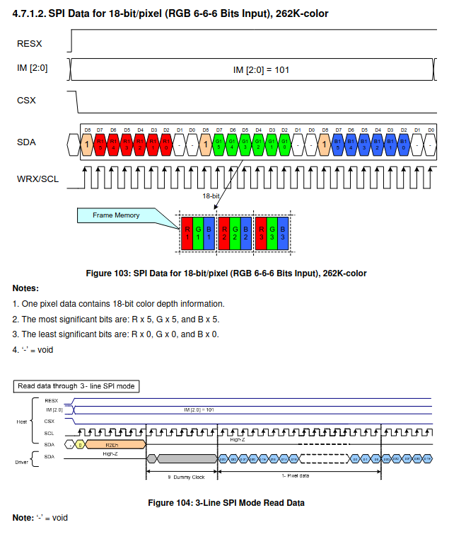

# Raspberry Pi Driver for the ILI9488 Touch Screen

This code allows you to connect your LCD screen and write data to it programmatically. It does not support connecting your desktop GUI to the LCD. The main use case is for users looking to create applications that require this type of LCD. It should work with any LCD that uses the ILI9488 processor.
## Requirements
To work with the LCD, you need to use the pigpio library (https://abyz.me.uk/rpi/pigpio/).

## How to Use It

Download the files into your project. The first section of the LCDScreen.h file contains the pin definitions. Feel free to modify them according to your needs.

In your code, initialize the class by calling `LCDScreen* lcd = new LCDScreen();`. The constructor sends several packets to the LCD screen using the SPI protocol. You can refer to the ILI9488 datasheet (http://www.lcdwiki.com/res/MSP3520/ILI9488%20Data%20Sheet.pdf) to review all the available commands in the command section on page 140. Currently, only a subset of commands is implemented, but you can add more as needed. These commands are defined in the LCDScreen.h file under the name `LCDCommand`.

To draw something on the screen, you need to fill a 1D buffer and send it using the function `DrawFrame(unsigned char* data, unsigned int size)`. The buffer varies with the `Interface Pixel Format`. By default, I put it in the 18-bits mode (18 / 3 = 6 bits by color : R - G - B) :

  
   
  <em>18bits Color</em>

Note: I am currently working on a program to draw rectangles, circles, listboxes, and to create a basic GUI at a higher level. For now, you will need to handle this on your own.

To use the touch screen, connect the LCD's IRQ touch pin to the appropriate pin on the Raspberry Pi. When you touch the screen, it will trigger the pin, and you can handle it in your code. The function `TouchScreen()` returns true if the screen has been touched. Afterward, calling `GetTouchCoord()` will give you the exact position of the touch.

I have included examples in the `examples` folder.

Feel free to contact me for further details.
